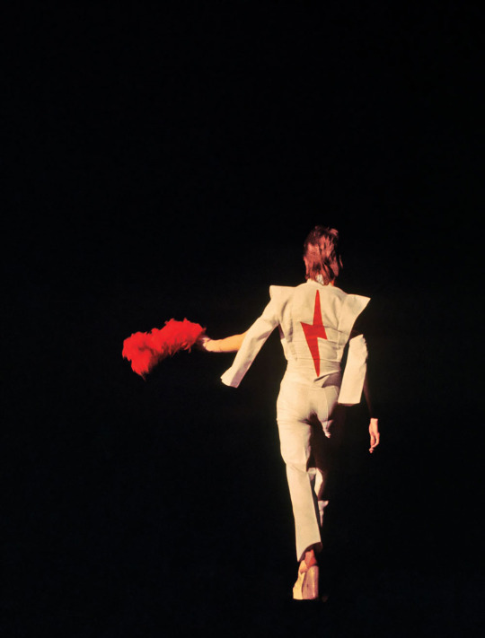

# My Syllabus Heading
## Readings
*This text will be italicized.*  
**This text will be bold.**
- Reading one
- Reading two
- Reading three  

Link [Loyola University Chicago Archives](https://www.luc.edu/archives)  

Look at this paragraph. It has two sentences.  

Here is a second paragraph. It also has two sentences.  

